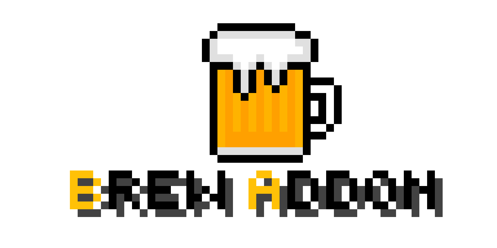

<p align="center">
    
</p>

<p align="center">
  
  
  
</p>

# 🍺 Brew Addon (WIP)
_A Meteor addon for the drunks_

## Installation
### Via GitHub Actions (recommended)
1. Go to the `Actions` tab of the repository
2. Select the Build JAR workflow
3. Click on the latest successfull run
4. Under the `Artifacts` section, you will find the built jar file.

### Manual
1. Clone the repository:
   ```bash
   git clone https://github.com/Eglijohn/eglis-autoplayaddon-addon.git
   ```

2. Navigate to the cloned directory:
   ```bash
   cd eglis-autoplayaddon-addon
   ```

3. Build the jar file:
   ```bash
   ./gradlew build
   ```

4. After building, the jar file will be located in the `build/libs` directory.

After that, you can copy the jar file to your Minecraft mods directory.

## Contributing
Got a new feature? PRs are welcome!

<details>
<summary>📋 To Do</summary>

- [x] Add addon structure
- [x] Teleport Util
- [x] Add modules
    - [ ] R3akeOn3_'s Auto Sign
    - [ ] R3akeOn3_'s Shulker Preview
    - [x] Eglijohn's stuff 
- [ ] Make support for mc 1.21.1 - Latest
- [ ] Get people to actually use it

</details>

---

Made with 🍺 by people who probably shouldn't be trusted with code.
